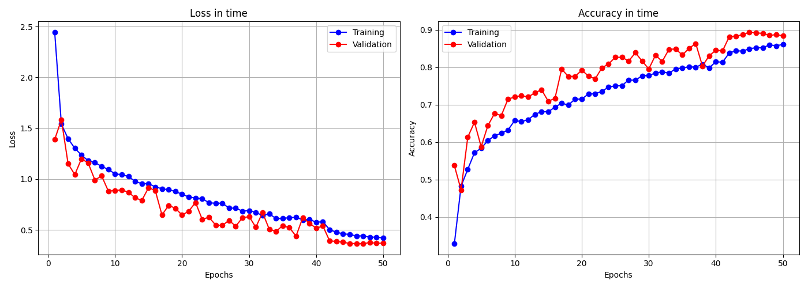
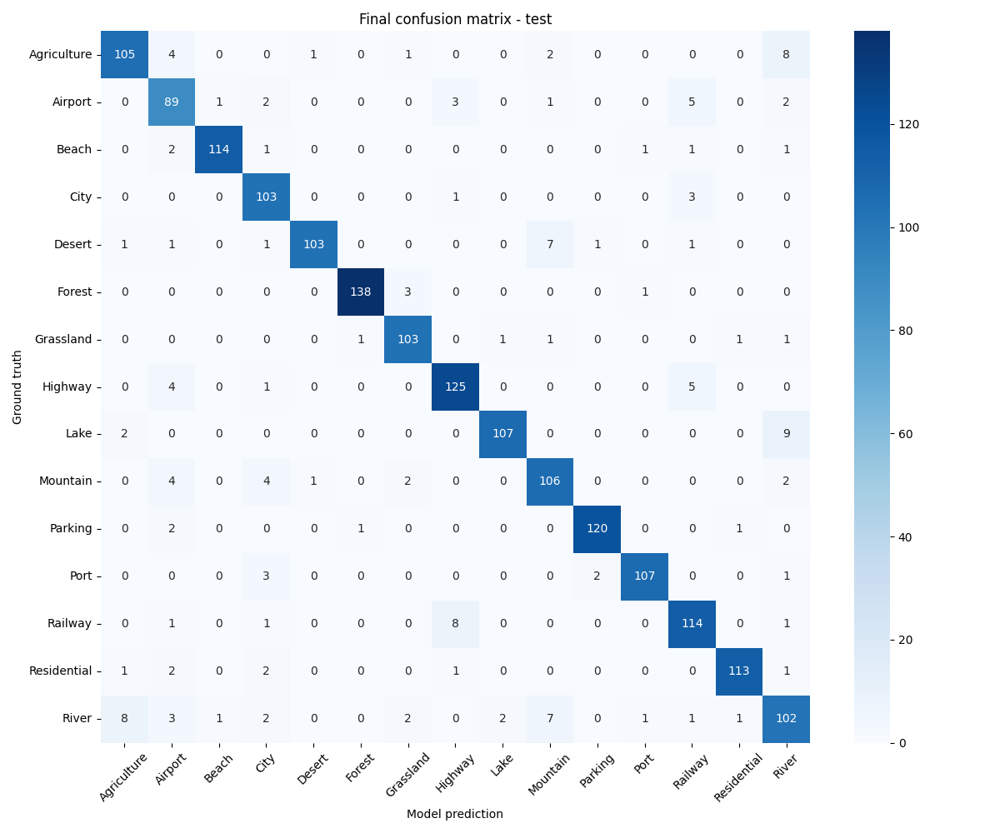

## 🛰️ Aerial Landscape Classifier
A high-performance **Convolutional Neural Network (CNN)** built with **PyTorch** to classify aerial and satellite imagery across 15 distinct landscape categories. This project covers the entire deep learning pipeline: from advanced data augmentation to detailed performance evaluation.

## 🚀 Performance Highlights
The model achieved exceptional results on the independent test set (data never seen during training):

* **Test Accuracy:** `91.4%`
* **Average F1-Score:** `0.91`
* **Total Classes:** 15

### Training Dynamics
The training process utilized the `ReduceLROnPlateau` scheduler, which intelligently lowered the learning rate when validation loss stagnated. This allowed the model to converge smoothly and achieve higher precision in later epochs.



### Confusion Matrix Analysis
The model shows near-perfect classification for high-contrast categories like **Parking**, **Beach**, and **Forest**. Minority errors occurred between visually similar classes, such as **River** and **Mountain**, which often share similar textures in certain terrains.



## 🏗️ Model Architecture
The custom CNN architecture was designed to balance depth and computational efficiency:

- **4 Convolutional Blocks:** Scaling from 16 to 128 filters (3x3 kernels).
- **Batch Normalization:** Applied after every convolution for stable and faster convergence.
- **Max Pooling:** 2x2 pooling with stride 2 for spatial dimensionality reduction.
- **Dropout Layers (0.5 & 0.3):** Strategic regularization to prevent overfitting.
- **LazyLinear Layers:** For dynamic input size handling between the feature extractor and classifier.

## 📁 Project Structure
- `dataset.py` – Data pipeline with advanced augmentation (flips, rotations, color jittering).
- `model.py` – Definition of the `AerialLandscapeCNN` class.
- `train.py` – Training script featuring the Adam optimizer and LR scheduler.
- `evaluate.py` – Detailed evaluation script generating classification reports and confusion matrices.
- `visualize.py` – Utility to plot Loss and Accuracy curves from training history.
- `predict.py` – Command-line interface for single image inference.

## 🛠️ Installation & Setup

### 1. Environment Preparation
It is recommended to use a virtual environment to avoid dependency conflicts.

```bash
# Clone the repository
git clone https://github.com/TomosZZZ/aerial-landscape-classification.git
cd aerial-landscape-classification

# Create and activate virtual environment
python -m venv venv
source venv/bin/activate  # On Windows: venv\Scripts\activate
```

### Install required libraries
```bash
pip install torch torchvision matplotlib seaborn scikit-learn pillow tqdm
```

### 2. Dataset Preparation

The project uses the **Skyview: An Aerial Landscape Dataset**.

- **Source:** [Kaggle - Skyview Dataset](https://www.kaggle.com/datasets/ankit1743/skyview-an-aerial-landscape-dataset)
- **Format:** Data is organized according to the `ImageFolder` standard.

**Automatic Setup (Kaggle CLI):**

```bash
kaggle datasets download -d ankit1743/skyview-an-aerial-landscape-dataset
unzip -q skyview-an-aerial-landscape-dataset.zip -d ./dataset
```

**Manual Setup:**

1. Download the ZIP from Kaggle.
2. Create a folder named `dataset` in the project root.
3. Unzip the content so the structure looks like this:

```
dataset/
└── Aerial_Landscapes/
    ├── Agriculture/
    ├── Airport/
    ├── Beach/
    ... (all 15 classes)
```

## 🚀 Quick Start

### 1. Training

To start the training process (50 epochs by default):

```bash
python train.py
```

### 2. Evaluation

To generate the F1-score report and the Confusion Matrix:

```bash
python evaluate.py
```

### 3. Visualization

To generate training curves (Loss/Accuracy):

```bash
python visualize.py
```

### 4. Custom Inference

To test the model on your own image:

1. Place your image as `test.jpg` in the root folder.
2. Run:

```bash
python predict.py
```

## 🏷️ Classes Recognized

The model identifies the following 15 categories:

`Agriculture` `Airport` `Beach` `City` `Desert` `Forest` `Grass` `Highway` `Industrial` `Lake` `Meadow` `Mountain` `Parking` `Railway` `River`

---

**Author:** Tomasz Okniński

*Developed as a comprehensive project in Computer Vision and Deep Learning.*

